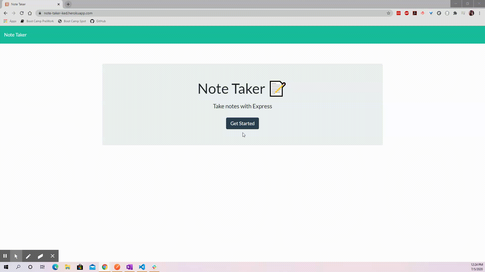

# Homework Assignment 11 - Note Taker Application


## Description

The goal of this assignment is to create an application that can be used to write, save, and delete notes entered by an end user. This application has both a front-end and back-end environment. The code for the front-end of the note taker application was already provided, so the main goal for students was to develop the back-end of the application and connect the developed back-end to the provided front-end code.

#### Reference Material

When developing this assignment, I reference and leverages the sample code provided in class for `Activity 15 - (Mini Project) Hot Restaurant`. Please note that I refactored / modified any leveraged code to meet the functionality needs for this note taker assignment.

- Click on the provided link to access the activity's repo: [Activity 15 - Mini Project- Hot Restaurant](https://github.com/the-Coding-Boot-Camp-at-UT/UT-AUS-FSF-PT-04-2020-U-C-MTTH/tree/master/01-Class-Content/11-express/01-Activities/15-HotRestaurant).

## Table of Contents

This section will be updated when ReadMe is finalized.

## Links for Submission Items

Links will be provided for each submission item once the assignment is complete and deployed.

- URL link to GitHub repo used to develop this assignment - [GitHub Repo for Note Taker Assignment](https://github.com/KEDuran/Note_Taker)
- URL link to deployed application on Heroku - [Note Take Application on Heroku](https://note-taker-ked.herokuapp.com/)

## Assignment Scope

### User Story

Here is the user story for this assignment that was provided by the Trilogy team.

```
AS A user, I want to be able to write and save notes

I WANT to be able to delete notes I've written before

SO THAT I can organize my thoughts and keep track of tasks I need to complete
```

### Acceptance Criteria

Here is a list of the acceptance criteria required for this assignment to meet MVP.

- Application should allow users to create and save notes.

- Application should allow users to view previously saved notes.

- Application should allow users to delete previously saved notes.

## Installation

In order to successfully develop and test this assignment, the following items must be installed and/or accessible from your working environment (i.e. laptop, computer, etc.).

#### Make Sure to Install / Run

- **Node.js** - Make sure Node.js is installed in your machine. If Node.js is not installed on your machine, [click here](https://nodejs.org/en/) to download the application.
- **NPM Install** - The `package.json` file included in this Note Taker repo already lists all NPM packages and dependencies that are required to successfully run this application. Please make sure to run the `NPM install` in the root directory to access all used\required packages.

## Final Output

The demo recording below demonstrates that the note taker application I developed and deployed on Heroku for this assignment meets the acceptance criteria outlined for this assignment.

The application allows the users to:

- create and save notes
- view previous notes
- delete previously saved notes

### Demo Recording


